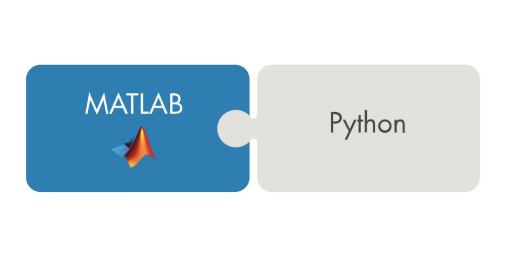
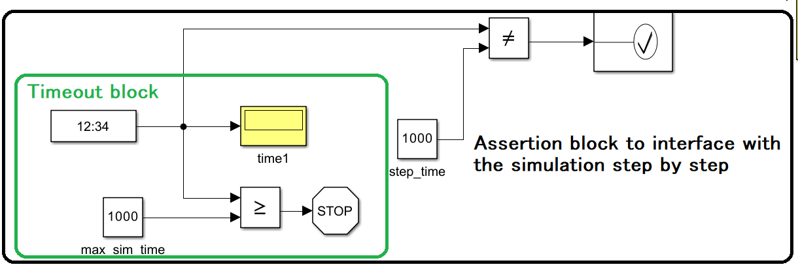
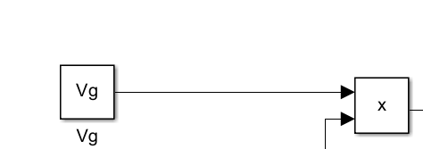

# Matlab2Py
Python interface with Matlab simulations at <b>Runtime</b> or <b>Offline</b>

# Matlab Engine Wrapper for Python
This repository contains a Python wrapper for the MATLAB Engine API, designed to facilitate the integration of MATLAB simulations into Python applications. Both the Online & Offline wrappers provide a high-level interface for controlling MATLAB simulations from Python. This README provides an overview of the repository's functionality and explains the possible configurations.
<p align="center"></p>


## Overview

The `OnlineEngine` & `OfflineEngine` classes are designed to abstract away the complexities of interacting with MATLAB simulations, allowing Python developers to control and manipulate MATLAB simulations with ease. It provides methods for starting, pausing, stepping through, and stopping simulations, as well as accessing and modifying simulation parameters.

### Interface mode : 
**Two main usecases are covered by this repo**

<b>1- Runtime or Online Engine :</b>
The simulation parameters and signals can be accessed through two modes : 

- `'sbs'`: Step by Step simulation. This mode allows for detailed control over the simulation, stepping through it one step at a time.
- `'sparsesbs'`: Sparse Step by Step simulation. This mode skips certain steps if they are deemed unnecessary, potentially speeding up the simulation.

<b>2- Offline Engine :</b>
This allows for the complete execution of the simulation followed by retrieving the output
## Setup 

[Install Matlab engine for Python](https://fr.mathworks.com/help/matlab/matlab_external/get-started-with-matlab-engine-for-python.html)

**NOTE for your matlabengine you need to install the python package matlabengine<=9.14.6**

Run ```python -m pip install -r requirements.txt```
## Engine Parameters

The `Online Engine` class constructor accepts several parameters that configure its behavior. Here's a brief explanation of each:

- `model_path`: The path to the MATLAB model file (.slx file) that contains the simulation to be controlled.
- `sim_path`: The path to the directory containing the simulation files. This is where the MATLAB Engine will look for the model file and any other necessary files.
- `model_name` : The name of the MATLAB model to be loaded. This is used to reference the model within the MATLAB Engine.
- `matlab_stepper` (default: 'step_time'): The name of the MATLAB block that controls the simulation's step size. This is used to advance the simulation one step at a time ([See How to set a stepper](#matlab-stepper)).
- `simulation_type` (default: 'sbs'): The type of simulation to run. The supported types are:
    - `'sbs'`: Step by Step simulation. This mode allows for detailed control over the simulation, stepping through it one step at a time.
    - `'sparsesbs'`: Sparse Step by Step simulation. This mode skips certain steps if they are deemed unnecessary, potentially speeding up the simulation.
    - `'normal'`: Normal simulation mode. This mode runs the simulation without any step-by-step control and the results should be retrived by the user afterwards.
- `max_steps`: This parameter sets the maximum number of steps for the simulation. It acts as a sort of timeout, preventing the simulation from running indefinitely. This is particularly useful in scenarios where you want to limit the simulation to a certain number of iterations for testing or debugging purposes([See How to set a timeout](#matlab-timeout)).

The `Offline Engine` class constructor is limited to :

- `model_path`
- `sim_path`
- `model_name` 


# Setup Timeout and Stepper blocks in Matlab
<p align="center"></p>


## Matlab timeout
The simplest way to set a tuneable timeout is to add a binary comparison block connected to your clock that'll be periodically compared to the max_sim_time (the name of the variable can be set progrmatically if you prefer otherwise)

## Matlab Stepper

Matlab Stepper allows to run through the simulation at specific time intervales and provides access to the Simulation variables during Runtime at sparse intervales (every `step_time`) rather than step by step iterations which can be very superfluous and overkill. This is done by adding an assertion block like in the figure; 

Note that it is necessary to set the following parameters in the assertion block (double click on the block ): Simulation callback when assertion fail = `set_param(bdroot,'SimulationCommand','pause')`

# How to use

## Retrieving Runtime Attributes
To retrieve runtime attributes, such as sensor readings from a robot, you need to define a Display Block in your MATLAB Simulink model. This block will be used to display the data you want to access from Python.

Steps to Add a Display Block
- Add a Display Block: In your MATLAB Simulink model, add a Display block. This block will be used to display the data you want to access from Python.
- Connect the Display Block: Connect the output of the sensor or the block whose data you want to access to the input of the Display block.
- Configure the Display Block: In the Display block's properties, ensure that it is configured to display the data you're interested in. You might need to adjust the data format or the update frequency depending on your requirements.
- Accessing the Data from Python: In your Python code, use the get_runtime_attribute method of the Engine class to access the data displayed by the Display block. You'll need to specify the path to the Display block in your Simulink model and the name of the attribute you want to access.

Example Usage :

**Assuming 'robot_readings' is the name of the Display block in your Simulink model**

```readings = engine.get_runtime_attribute('robot_readings', block_path='/Sensor/Display')```

## Retrieving Final Simulation Outputs
To retrieve the final output of the simulation, such as the simulation status or specific simulation variables, you need to define a "To Workspace" Block in your MATLAB Simulink model. This block will store the data you want to access in the MATLAB workspace.

Steps to Add a "To Workspace" Block
- Add a "To Workspace" Block: In your MATLAB Simulink model, add a "To Workspace" block. This block will be used to store the data you want to access from Python.
- Connect the "To Workspace" Block: Connect the output of the block whose data you want to store to the input of the "To Workspace" block.
- Configure the "To Workspace" Block: In the "To Workspace" block's properties, specify the variable name under which the data will be stored in the MATLAB workspace.
- Accessing the Data from Python: In your Python code, use the get_simout method of the Engine class to access the data stored by the "To Workspace" block. You'll need to specify the name of the variable you used in the "To Workspace" block.

Example Usage :

**Assuming 'simout' is the name of the variable you used in the "To Workspace" block**

```sim_output = engine.get_simout('simout')```

By following these steps, you can set up your MATLAB simulation to allow the Python interface to access runtime attributes and final simulation outputs

## Updating simulation parameters during Runtime

The ```set_param``` method allows you to dynamically modify simulation parameters in your MATLAB Simulink model from Python during Runtime (inside an iterative training loop for example)

Example Usage :

**Assuming ```Vg``` is a parameter that was initialized in your workspace and is to be updated in your simulation calculations (defined as constant block in simulink)**
<p align="center"></p>

```engine.set_param('Vg', 0.1)```


# Example

An example using a functioning simulation can be viewed in 

- [Thimyo training using RL (Online)](https://github.com/Spinkoo/Matlab2TorchRL/blob/main/gyms/envs/test.py)

- [Simulation based inference (Offline)](https://github.com/Spinkoo/Simulink-based-inference)

## Acknowledgments

- This work was supported by the French National Research Agency under the France 2030 program project IRT Nanoelec (ANR-10-AIRT-05).